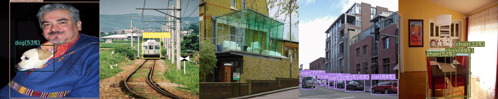

# <div align="center">YOLOv2</div>

---

## [Content]
1. [Description](#description)   
2. [Usage](#usage)  
2-1. [K-medoids Anchor Clustering](#k-medoids-anchor-clustering)  
2-2. [Model Training](#model-training)  
2-3. [Detection Evaluation](#detection-evaluation)  
2-4. [Result Analysis](#result-analysis)  
3. [Contact](#contact)   

---

## [Description]

This is a repository for PyTorch implementation of YOLOv2 following the original paper (https://arxiv.org/abs/1612.08242).   
By applying the multi-scale training technique, I found that mAP drops by about 1 points. Instead, It shows that there is reasonable compensation in terms of not having to retrain each time for various input resolutions.


 - **Performance Table**

| Model | Dataset | Train | Valid | Size<br><sup>(pixel) | mAP<br><sup>(@0.5:0.95) | mAP<br><sup>(@0.5) | Params<br><sup>(M) | FLOPS<br><sup>(B) |
| :---: | :---: | :---: | :---: | :---: | :---: | :---: | :---: | :---: | 
| YOLOv2<br><sup>(<u>Paper:page_with_curl:</u>)</br> | PASCAL-VOC | trainval2007+2012 | test2007 | 416 | 51.0 | 76.8 | *not reported* | 34.90 |
| YOLOv2<br><sup>(<u>Our:star:</u>)</br> | PASCAL-VOC | trainval2007+2012 | test2007 | 416 | 48.1 | 75.3 | 50.67 | 29.49 |
| YOLOv2-multiscale<br><sup>(<u>Our:star:</u>)</br> | PASCAL-VOC | trainval2007+2012 | test2007 | 320~608 | 45.1 | 74.1 | 50.67 | 29.49 |
| YOLOv2<br><sup>(<u>Our:star:</u>)</br> | COCO | train2017 | val2017 | 416 | 26.7 | 45.5 | 50.67 | 29.49 |


 - **Pretrained Model Download**

	- [DarkNet-19 Backbone](https://drive.google.com/file/d/1rRHFXzqTtCyP69f4ygjA-qrjSVf2tBPv/view?usp=share_link)
	- [YOLOv2 trained on VOC (AP@0.50 - 75.3)](https://drive.google.com/file/d/16TZ6BAaoGo9kRPIcXroWzngb7ZU_tt0L/view?usp=share_link)
	- [YOLOv2-multiscale trained on VOC (AP@0.50 - 74.1)](https://drive.google.com/file/d/1vFbmQXoGNNqNq79K4nuhSSbNHHph81e_/view?usp=share_link)
	- [YOLOv2 trained on COCO2017 (AP@0.50:0.95 - 45.5)](https://drive.google.com/file/d/1qorkqX0k92iUK63nUtUweHU5qvtC2kzk/view?usp=share_link)





## [Usage]

#### K-medoids Anchor Clustering   
 - You extract anchor box priors from all instances' boxes at first.

 ```python
python kmedoids_anchor.py --exp my_test --data voc.yaml
 ```


```log
2022-11-16 13:43:54 | Avg IOU: 62.01%
2022-11-16 13:43:54 | Boxes:
    [[0.068      0.11711711]
    [0.16       0.26666668]
    [0.278      0.60982656]
    [0.776      0.82133335]
    [0.494      0.40533334]]
2022-11-16 13:43:54 | Ratios: [0.46, 0.58, 0.6, 0.94, 1.22]
```

<div align="center">

  <a href=""></a>

</div>


#### Model Training 
 - You can train your own YOLOv2 model using Darknet-19 with anchor box from above step.

```python
python train.py --exp my_test --data voc.yaml
```


#### Detection Evaluation
 - You can compute detection metric via mean Average Precision(mAP) with IoU of 0.5, 0.75, 0.5:0.95. I follow the evaluation code with the reference on https://github.com/rafaelpadilla/Object-Detection-Metrics.

```python
python val.py --exp my_test --data voc.yaml --ckpt_name best.pt
```


#### Result Analysis
 - After training is done, you will get the results shown below.

<div align="center">

  <a href=""></a>

</div>


```log
2022-11-24 00:05:50 | YOLOv2 Architecture Info - Params(M): 50.67, FLOPS(B): 29.49
2022-11-24 00:11:46 | [Train-Epoch:001] multipart: 47.5865  obj: 0.3412  noobj: 39.8344  txty: 0.3336  twth: 1.3665  cls: 4.3459  
2022-11-24 00:16:35 | [Train-Epoch:002] multipart: 5.2848  obj: 0.4527  noobj: 0.4779  txty: 0.2533  twth: 0.5172  cls: 1.7730  
2022-11-24 00:21:20 | [Train-Epoch:003] multipart: 4.7149  obj: 0.4151  noobj: 0.6242  txty: 0.2230  twth: 0.3704  cls: 1.4219  
2022-11-24 00:25:57 | [Train-Epoch:004] multipart: 4.4068  obj: 0.3878  noobj: 0.6716  txty: 0.2124  twth: 0.3370  cls: 1.2465  
2022-11-24 00:30:33 | [Train-Epoch:005] multipart: 4.2239  obj: 0.3716  noobj: 0.6863  txty: 0.2042  twth: 0.3206  cls: 1.1549  
2022-11-24 00:35:08 | [Train-Epoch:006] multipart: 4.0749  obj: 0.3551  noobj: 0.6898  txty: 0.1996  twth: 0.3054  cls: 1.1047  
2022-11-24 00:39:49 | [Train-Epoch:007] multipart: 3.9681  obj: 0.3493  noobj: 0.6986  txty: 0.1950  twth: 0.2917  cls: 1.0364  
2022-11-24 00:44:25 | [Train-Epoch:008] multipart: 3.9203  obj: 0.3470  noobj: 0.7098  txty: 0.1907  twth: 0.2743  cls: 1.0106  
2022-11-24 00:49:01 | [Train-Epoch:009] multipart: 3.7825  obj: 0.3335  noobj: 0.7053  txty: 0.1868  twth: 0.2739  cls: 0.9491  
2022-11-24 00:53:37 | [Train-Epoch:010] multipart: 3.7485  obj: 0.3315  noobj: 0.7096  txty: 0.1834  twth: 0.2738  cls: 0.9241  
2022-11-24 00:54:57 | 
	 - Average Precision (AP) @[ IoU=0.50:0.95 | area=   all | maxDets=100 ] = 0.298
	 - Average Precision (AP) @[ IoU=0.50      | area=   all | maxDets=100 ] = 0.589
	 - Average Precision (AP) @[ IoU=0.75      | area=   all | maxDets=100 ] = 0.250
	 - Average Precision (AP) @[ IoU=0.50:0.95 | area= small | maxDets=100 ] = 0.009
	 - Average Precision (AP) @[ IoU=0.50      | area= small | maxDets=100 ] = 0.042
	 - Average Precision (AP) @[ IoU=0.50:0.95 | area=medium | maxDets=100 ] = 0.114
	 - Average Precision (AP) @[ IoU=0.50      | area=medium | maxDets=100 ] = 0.279
	 - Average Precision (AP) @[ IoU=0.50:0.95 | area= large | maxDets=100 ] = 0.361
	 - Average Precision (AP) @[ IoU=0.50      | area= large | maxDets=100 ] = 0.681

                                                ...

2022-11-24 16:37:12 | [Train-Epoch:199] multipart: 1.8789  obj: 0.1728  noobj: 0.5847  txty: 0.1090  twth: 0.1221  cls: 0.1992  
2022-11-24 16:37:13 | [Best mAP at 190]

	 - Average Precision (AP) @[ IoU=0.50:0.95 | area=   all | maxDets=100 ] = 0.481
	 - Average Precision (AP) @[ IoU=0.50      | area=   all | maxDets=100 ] = 0.753
	 - Average Precision (AP) @[ IoU=0.75      | area=   all | maxDets=100 ] = 0.501
	 - Average Precision (AP) @[ IoU=0.50:0.95 | area= small | maxDets=100 ] = 0.061
	 - Average Precision (AP) @[ IoU=0.50      | area= small | maxDets=100 ] = 0.174
	 - Average Precision (AP) @[ IoU=0.50:0.95 | area=medium | maxDets=100 ] = 0.230
	 - Average Precision (AP) @[ IoU=0.50      | area=medium | maxDets=100 ] = 0.460
	 - Average Precision (AP) @[ IoU=0.50:0.95 | area= large | maxDets=100 ] = 0.552
	 - Average Precision (AP) @[ IoU=0.50      | area= large | maxDets=100 ] = 0.807
```


<div align="center">

<a href=""></a> <a href=""></a> <a href=""></a> <a href=""></a>

</div>


---
## [Contact]
- Author: Jiho Park  
- Email: pjh5672.dev@gmail.com  